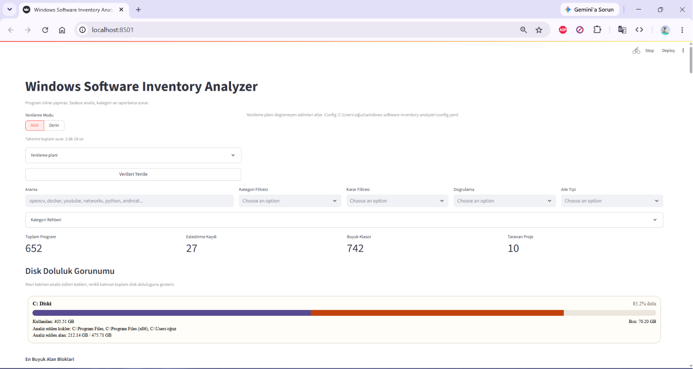
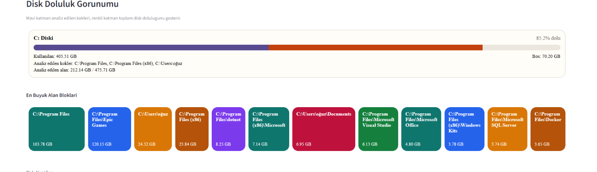
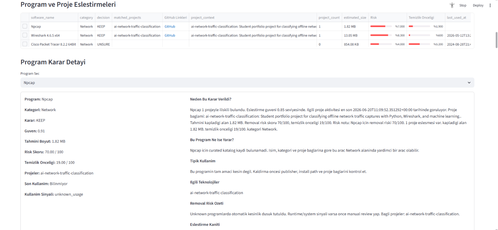
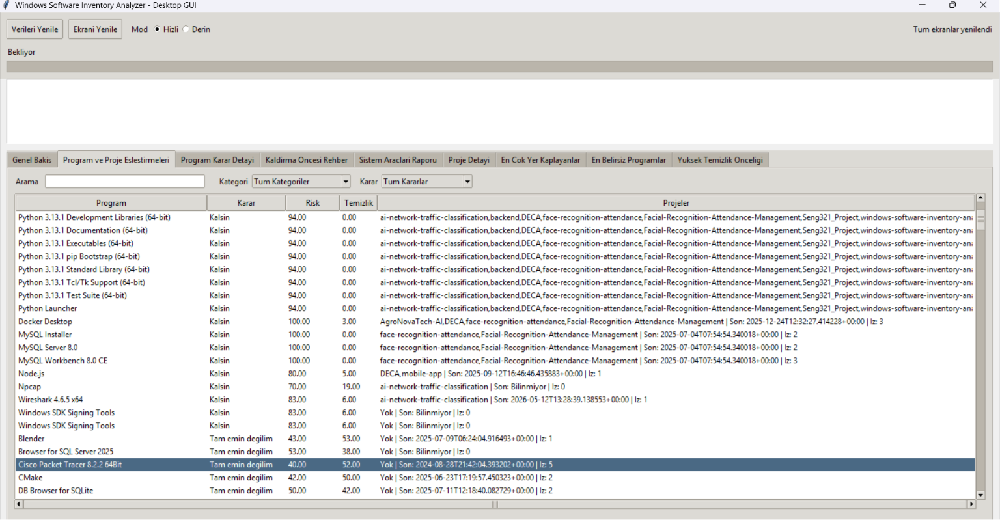
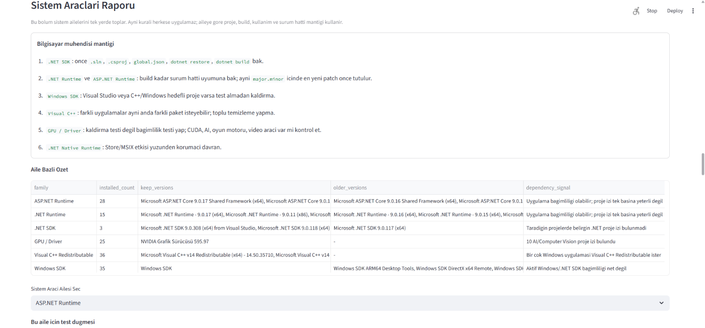
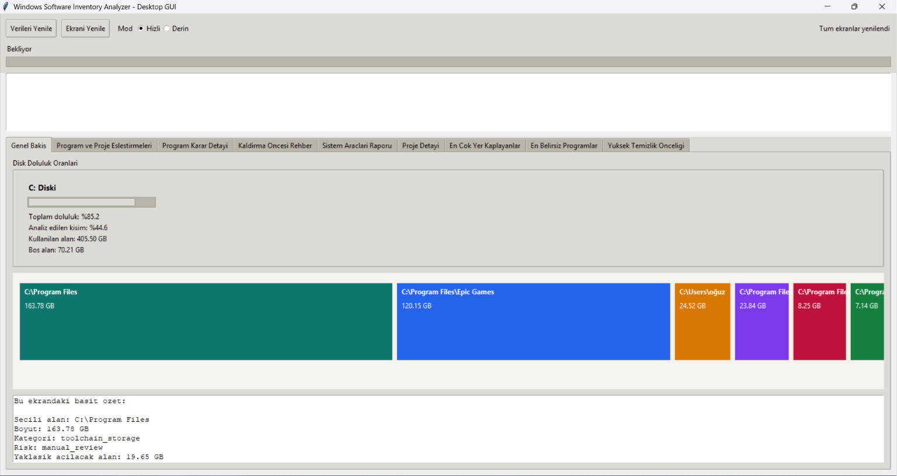
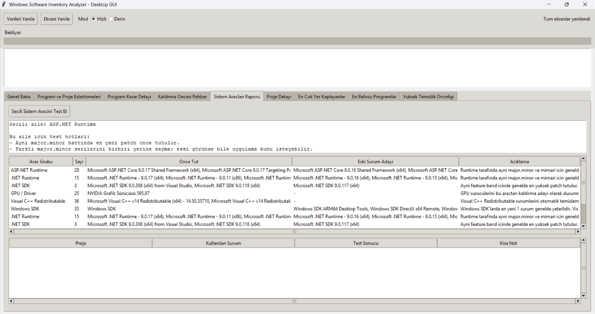

# Windows Software Inventory Analyzer

Windows Software Inventory Analyzer, Windows geliştirici bilgisayarında kurulu programları, disk kullanımını, proje klasörlerini, teknoloji bağımlılıklarını ve sistem araçlarını read-only biçimde inceleyen bir analiz platformudur.

Bu proje klasik bir "disk temizleme aracı" gibi doğrudan silme yapmaz. Amaç, bilgisayar mühendisi bakışıyla şu sorulara kanıta dayalı cevap üretmektir:

- Bu program ne işe yarıyor?
- Bu araç hangi projelerim için gerekli?
- Hangi klasörler en çok alan kaplıyor?
- Hangi alan yeniden üretilebilir cache/artifact alanı?
- Bir programı kaldırmadan önce risk ne?
- .NET SDK, Windows SDK, runtime, driver gibi sistem araçlarında hangi sürümler tutulmalı?
- Hangi karar sadece tahmin, hangisi doğrulama ile güçlendirilmiş?

## Projenin Amacı

Bu proje, geliştirici makinesini rastgele temizlemek yerine sistematik analiz etmeyi hedefler. Özellikle uzun süre kullanılan Windows bilgisayarlarda şu problemler oluşur:

- Aynı aracın birden fazla sürümü kurulu kalır
- Eski proje bağımlılıkları unutulur
- `node_modules`, `.venv`, `.gradle`, Docker cache, build çıktıları gereksiz alan kaplar
- Programın gerçekten kullanılıp kullanılmadığı net değildir
- Runtime / SDK / driver ailesindeki araçları kaldırmak risklidir

Bu sistem, doğrudan uninstall yapmadan önce envanter, ilişki, kullanım izi, proje etkisi ve doğrulama katmanlarını bir araya getirir.

## Ekran Görüntüleri

### 1. Streamlit Dashboard Genel Bakış

Ana dashboard ekranı; genel durum, yenileme akışı, rapor özetleri ve analiz platformunun üst seviye görünümünü sunar.



### 2. Disk Doluluk ve Alan Blokları

Disk alanının hangi klasör aileleri tarafından kullanıldığını, büyük alan bloklarını ve temizlik senaryosu üretilebilecek bölgeleri gösterir.



### 3. Program Karar Detayı

Seçilen bir yazılım için neden `KEEP`, `UNSURE`, `MANUAL_REVIEW` veya `CAN_REMOVE` benzeri karar üretildiğini; risk puanı, kullanım izi ve açıklama katmanıyla birlikte gösterir.



### 4. Program ve Proje Eşleştirme

Kurulu araçların hangi projeler ve teknoloji stack'leri ile ilişkili olduğunu gösterir. Bu ekran, "bu araç gerçekten hangi proje için gerekli?" sorusunun merkezindedir.



### 5. Sistem Araçları Raporu - Streamlit

`.NET SDK`, `.NET Runtime`, `Windows SDK`, `Visual C++` ve benzeri sistem araçları için aile bazlı değerlendirme sunar.



### 6. Desktop GUI Genel Görünüm

Terminal kullanmadan analiz sonuçlarını izlemek isteyen kullanıcılar için masaüstü arayüzünün genel görünümüdür.



### 7. Desktop GUI Sistem Araçları Görünümü

Masaüstü arayüzünde sistem araçları raporunun nasıl gösterildiğini ve aile bazlı karar ekranını örnekler.



## Güvenlik Modeli

Bu proje varsayılan olarak **read-only** çalışır.

- Dosya silmez
- Program kaldırmaz
- Registry üzerinde değişiklik yapmaz
- Sistem ayarlarını değiştirmez
- Sadece tarama, ilişkilendirme, puanlama, senaryo üretme ve raporlama yapar

Nihai karar kullanıcıya aittir. Özellikle aşağıdaki ailelerde otomatik sil önerisi verilmez:

- `.NET Runtime`
- `.NET SDK`
- `ASP.NET Runtime`
- `Windows SDK`
- `Microsoft Visual C++ Redistributable`
- `GPU / Driver`
- diğer kritik runtime / system araçları

## Mühendislik Yaklaşımı

Proje şu sistematik yaklaşımı kullanır:

1. Çok kaynaklı gözlem
   Windows üzerindeki bilgi tek bir kaynaktan alınmaz. Kurulu programlar `winget` ve registry uninstall kayıtlarından birlikte toplanır.

2. Dosya sistemi temelli analiz
   Disk kullanımı, proje boyutu, alt klasör kırılımı ve yeniden üretilebilir alanlar ayrı incelenir.

3. Proje-bağımlılık ilişkisi
   Bir aracın gerçekten gerekli olup olmadığı, geçmiş projelerdeki dependency ve kod sinyalleri üzerinden değerlendirilir.

4. Kullanım sinyali analizi
   Son kullanım izleri, shortcut / recent / benzeri kaynaklardan okunur; veri yoksa sahte tarih üretilmez.

5. Kademeli karar modeli
   `KEEP`, `UNSURE`, `MANUAL_REVIEW`, `CAN_REMOVE` kararları tek sinyalle değil; proje ilişkisi, kullanım izi, sistem ailesi, publisher ve boyut gibi birden çok sinyal ile üretilir.

6. Doğrulama seviyesi
   Bazı aileler için statik analiz yeterlidir, bazıları için build doğrulaması gerekir. Örneğin `.NET SDK` kararında proje bazlı build doğrulaması daha güçlü kanıt sayılır.

7. Artımlı yenileme
   `refresh-all` her seferinde her şeyi baştan taramaz. Değişmeyen adımlar mümkünse atlanır. Hızlı ve derin yenileme ayrımı vardır.

## Sprint Özeti: Şu Ana Kadar Neler Yapıldı?

Bu repo artık tek modüllü bir script değil, çok adımlı bir analiz pipeline'ı haline geldi. Yapılan ana modüller:

- Sprint 0: repo yapısı, config, logging, read-only prensibi
- Sprint 1: kurulu program envanteri
- Sprint 2: disk kullanımı ve developer cache analizi
- Sprint 3: proje tarama ve teknoloji stack çıkarımı
- Sprint 4: program-proje eşleştirme motoru
- Sprint 5: kategorileme ve karar motoru
- Sprint 6: Streamlit dashboard ve raporlama
- Sprint 7: test, dry-run, verbose, örnek veri
- Sprint 8: son kullanım izleri toplama
- Sprint 9: risk skorlama motoru
- Sprint 10: repo derin analizi, import / framework sinyalleri
- Sprint 11: program bilgi tabanı ve açıklama üretimi
- Sprint 12: disk zone analizi ve disk temizleme senaryoları
- Sprint 13: disk detay UI ve etkileşimli alan yorumları
- Sprint 14: proje boyutu ve proje depolama kırılımı
- Sprint 15: kaldırma karar motoru V2 ve karar detayları
- Sprint 16: hızlı / derin yenileme ve incremental refresh planner
- Sprint 17: aile bazlı doğrulama stratejileri
- Sprint 18: sistem araçları raporu
- Sprint 19: Streamlit ve desktop GUI için ortak view-model mantığı
- Sprint 20: çoklu kaldırma senaryo planlayıcısı

## Gereksinimler

- Windows 10 / 11
- Python `3.11` önerilir
- PowerShell
- İsteğe bağlı:
  - `winget`
  - `.NET SDK`
  - `git`
  - `streamlit`

`requirements.txt` şu anda hafif tutulmuştur:

- `streamlit==1.46.1`
- `pytest==8.3.5`

## Kurulum

PowerShell içinde proje kök dizininde:

```powershell
py -3.11 -m venv .venv
.venv\Scripts\Activate.ps1
python -m pip install --upgrade pip
pip install -r requirements.txt
Copy-Item config.example.yaml config.yaml
```

Eğer `Activate.ps1` policy nedeniyle çalışmıyorsa:

```powershell
Set-ExecutionPolicy -Scope Process -ExecutionPolicy Bypass
.venv\Scripts\Activate.ps1
```

Python sürümünü kontrol etmek için:

```powershell
python --version
```

## Config Yapısı

Örnek dosya: [config.example.yaml](C:\Users\oğuz\windows-software-inventory-analyzer\config.example.yaml)

Temel alanlar:

```yaml
scan:
  disks:
    - "C:\\"
  project_roots:
    - "%USERPROFILE%\\source"
    - "%USERPROFILE%"
    - "%USERPROFILE%\\projects"
    - "C:\\Projects"
  disk_usage_roots:
    - "C:\\Program Files"
    - "C:\\Program Files (x86)"
    - "%LOCALAPPDATA%"
    - "%USERPROFILE%"
  exclude_paths:
    - "C:\\Windows"
    - "C:\\Program Files\\WindowsApps"
    - "C:\\$Recycle.Bin"
    - "C:\\System Volume Information"
    - "%USERPROFILE%\\AppData"
  max_depth: 2

report:
  output_dir: "./data/output"
  formats:
    - "csv"
    - "json"

logging:
  level: "INFO"
  log_to_file: false
  log_dir: "./data/output/logs"

behavior:
  read_only: true
  allow_delete: false
  allow_uninstall: false
```

### Config Nasıl Düzenlenmeli?

- `project_roots`: proje klasörlerin gerçekten burada olmalı
- `disk_usage_roots`: taranmasını istediğin büyük alanlar
- `exclude_paths`: performans ve güvenlik için dışarıda bırakılacak klasörler
- `max_depth`: disk taramasının derinliği

Özellikle kendi projelerin `C:\Users\<kullanici>` altında dağınıksa, bu klasörleri burada açıkça belirtmek gerekir.

## Proje Notları ve GitHub Bağlamı

Projelere manuel açıklama eklemek için:

```powershell
Copy-Item project_notes.example.csv project_notes.csv
```

Bu dosyada şu alanlar kullanılabilir:

- `project_name`
- `path`
- `github_url_override`
- `repo_description_override`
- `user_notes`

Bu sayede sistem yalnızca dependency dosyalarına değil, senin verdiğin bağlama da bakar. Örneğin:

- "Bu proje ders projesiydi"
- "Docker burada zorunlu"
- "Bu repo eski ama tekrar açabilirim"

Bu bilgiler karar motoruna ve UI açıklamalarına yansır.

## Terminalden Çalıştırma

Ana giriş noktası:

```powershell
python -m src.main --config config.yaml
```

Varsayılan davranış `refresh-all` akışıdır.

### En Önemli Komut: Tüm Verileri Yenile

Hızlı mod:

```powershell
python -m src.main refresh-all --config config.yaml --refresh-mode quick
```

Derin mod:

```powershell
python -m src.main refresh-all --config config.yaml --refresh-mode full
```

Fark:

- `quick`: değişmeyen adımları atlar, var olan raporları kullanır, daha hızlıdır
- `full`: daha kapsamlı tarar, daha yavaştır ama daha güncel sonuç üretir

### Tek Tek Modüller

Kurulu programları topla:

```powershell
python -m src.main collect-programs --config config.yaml
```

Kullanım sinyallerini topla:

```powershell
python -m src.main collect-usage --config config.yaml
```

Disk kullanımını tara:

```powershell
python -m src.main scan-disk --config config.yaml --refresh-mode quick
```

Projeleri tara:

```powershell
python -m src.main scan-projects --config config.yaml --refresh-mode quick
```

Program-proje eşleştirmesi üret:

```powershell
python -m src.main map-software --config config.yaml
```

Risk skorlarını üret:

```powershell
python -m src.main score-risk --config config.yaml
```

Kararları üret:

```powershell
python -m src.main recommend --config config.yaml
```

.NET SDK raporu üret:

```powershell
python -m src.main analyze-dotnet-sdk --config config.yaml --refresh-mode quick
```

.NET SDK doğrulama çalıştır:

```powershell
python -m src.main validate-dotnet-sdks --config config.yaml --refresh-mode quick
```

Projeler için aile bazlı doğrulama yap:

```powershell
python -m src.main validate-projects --config config.yaml
```

Kaldırma karar motorunu çalıştır:

```powershell
python -m src.main build-removal-decisions --config config.yaml
```

Sistem araçları raporunu üret:

```powershell
python -m src.main build-system-tools-report --config config.yaml
```

Çoklu kaldırma senaryosu üret:

```powershell
python -m src.main plan-cleanup-simulation --config config.yaml
```

### Dry-Run ve Verbose

Dry-run:

```powershell
python -m src.main recommend --config config.yaml --dry-run
```

Verbose:

```powershell
python -m src.main scan-projects --config config.yaml --verbose
```

### Eski Giriş Noktası

İstersen bu da çalışır:

```powershell
python main.py
```

## Streamlit Dashboard

Dashboard açmak için:

```powershell
python dashboard.py
```

Alternatif:

```powershell
streamlit run dashboard.py
```

Dashboard içinde şunlar bulunur:

- genel bakış
- hızlı / derin yenileme
- adım bazlı ilerleme ve log görüntüsü
- program ve proje eşleştirmeleri
- program karar detayı
- kaldırma öncesi rehber
- sistem araçları raporu
- `.NET SDK` raporu
- proje detay paneli
- en çok yer kaplayan alanlar
- en belirsiz programlar
- yüksek temizlik önceliği
- disk blokları ve temizleme senaryoları
- çoklu kaldırma simülasyonu

Dashboard teknik terimleri mümkün olduğunca sade göstermeye çalışır; ancak arka plandaki raporlar daha mühendisçe detay içerir.

## Desktop GUI

Masaüstü arayüzü açmak için:

```powershell
python desktop_gui.py
```

GUI tarafında da Streamlit ile benzer akışlar vardır:

- hızlı / derin yenileme seçimi
- ilerleme yüzdesi
- sistem araçları raporu
- kaldırma öncesi sihirbaz
- program karar detayı
- proje detay görünümü
- büyük alan blokları
- yüksek temizlik önceliği listeleri

Amaç, terminal kullanmadan da analiz sonuçlarını izleyebilmektir.

## Çıktı Dosyaları

Üretilen raporlar `data/output/` altında tutulur.

### Envanter ve Kullanım

- `installed_programs.csv`
- `installed_programs.json`
- `program_usage_signals.csv`

### Disk ve Alan Analizi

- `disk_usage.csv`
- `developer_caches.csv`
- `disk_zone_report.csv`
- `disk_cleanup_scenarios.csv`

### Proje ve Kod Analizi

- `project_tech_stack.csv`
- `project_code_signals.csv`
- `project_files_index.csv`
- `project_size_report.csv`
- `project_storage_breakdown.csv`

### Eşleştirme, Karar ve Risk

- `software_project_mapping.csv`
- `program_risk_scores.csv`
- `recommendations.csv`
- `removal_decisions.csv`
- `cleanup_simulation.csv`

### Sistem Araçları ve Doğrulama

- `dotnet_sdk_decision_report.csv`
- `sdk_validation_report.csv`
- `validation_status.csv`
- `system_tools_report.csv`
- `system_tool_impact_report.csv`

### Açıklama Katmanı

- `software_descriptions.json`

### Yardımcı Klasörler

- `data/output/sdk_validation_artifacts/`
- `data/output/validation_artifacts/`

## Modüller Ne Yapar?

### 1. Kurulu Program Envanteri

Kaynak:

- `winget list`
- registry uninstall kayıtları

Çıktı:

- normalize edilmiş program adı
- sürüm
- publisher
- install path
- uninstall string
- source

Amaç:

- Makinede gerçekten ne kurulu görmek
- Aynı programın kopya kayıtlarını temizlemek

### 2. Disk Kullanımı ve Developer Cache Analizi

Taranan ana aileler:

- `Program Files`
- `Program Files (x86)`
- kullanıcı klasörleri
- AppData kökenli alanlar

Ayrı işaretlenen yeniden üretilebilir alanlar:

- `node_modules`
- `.venv`
- `__pycache__`
- `.gradle`
- `.m2`
- pip cache
- npm cache
- Docker cache

Amaç:

- Büyük alanları sıralamak
- Kaynak kod ile yeniden üretilebilir artifact alanını ayırmak

### 3. Proje Tarama ve Teknoloji Çıkarma

Taranan tipik dosyalar:

- `package.json`
- `requirements.txt`
- `pyproject.toml`
- `environment.yml`
- `Dockerfile`
- `docker-compose.yml`
- `pom.xml`
- `build.gradle`
- `.sln`
- `.csproj`

Kod seviyesi sinyaller:

- Python `import`
- JS/TS `import` / `require`
- Java `import`
- C# `using`

Amaç:

- Bu makinedeki projelerin hangi teknolojileri kullandığını çıkarmak
- Programları projelerle ilişkilendirmek

### 4. Program-Proje Eşleştirme Motoru

Örnek mantık:

- `requirements.txt` varsa `Python`
- `package.json` varsa `Node.js / npm`
- `Dockerfile` varsa `Docker`
- `pom.xml` varsa `Java / Maven`
- `.sln` veya `.csproj` varsa `.NET`

Bu katman tek başına kesin karar vermez; sadece güçlü sinyal üretir.

### 5. Son Kullanım İzi

Bu modül mümkün olduğunca şuna cevap arar:

- Bu araç gerçekten yakın zamanda kullanıldı mı?
- Son kullanım tarihi bulunabiliyor mu?
- Kaç ayrı kullanım izi var?

Veri yoksa sistem "bilmiyorum" demelidir; sahte tarih üretmez.

### 6. Risk Skoru ve Karar Motoru

Karar üretirken kullanılan ana sinyaller:

- proje ilişkisi
- kullanım izi
- kategori
- sistem / runtime ailesi
- publisher güveni
- kapladığı alan

Temel çıktılar:

- `risk_score`
- `cleanup_priority_score`
- `recommendation`
- açıklama

### 7. Sistem Araçları Analizi

Özellikle şu aileler daha dikkatli ele alınır:

- `.NET SDK`
- `.NET Runtime`
- `ASP.NET Runtime`
- `Windows SDK`
- `Visual C++ Redistributable`
- `GPU / Driver`
- `.NET Native Runtime`

Bu ailelerde karar mantığı "boş yere büyük yer kaplıyor" kadar basit değildir. Aile bazlı kurallar uygulanır.

### 8. Doğrulama Stratejileri

Her aileye aynı test uygulanmaz:

- `.NET SDK` -> çözüm / proje / build doğrulaması
- `Python` -> izole venv içinde parse / doğrulama
- `Node` -> izole install / build yaklaşımı
- `Java` -> maven / gradle mantığına uygun doğrulama
- `Windows SDK`, `GPU Driver`, `Visual C++` -> koruma ağırlıklı statik analiz

Bu yüzden `validation_level` alanı önemlidir:

- `STATIC_ONLY`
- `BUILD_VERIFIED`
- `ISOLATED_REINSTALL_VERIFIED`

## Hızlı ve Derin Yenileme Mantığı

Bu proje artık uzun süren her adımı her seferinde sıfırdan çalıştırmaz.

### Hızlı Mod

Şunları hedefler:

- değişmeyen çıktıları yeniden üretmemek
- proje ve disk taramasında daha hafif yol izlemek
- UI'da daha hızlı geri bildirim vermek

### Derin Mod

Şunları hedefler:

- tüm zinciri daha kapsamlı tazelemek
- disk ve proje analizini daha geniş kapsamlı yapmak

### Ne Zaman Hangisi?

- Sadece yeni repo çektiysen veya küçük değişiklik yaptıysan: `quick`
- Disk düzenin ciddi değiştiyse veya daha doğru rapor istiyorsan: `full`

## Kaldırma Kararı Nasıl Düşünülmeli?

Bu proje "sil / silme" yerine mühendisçe bir karar çerçevesi sunar.

### Güvenli yaklaşım

1. Önce proje bağı var mı bak
2. Son kullanım izi var mı bak
3. Bu araç runtime / SDK / driver ailesinde mi bak
4. Aynı ailenin birden fazla sürümü varsa en yeni / aktif olanı belirle
5. Test edilebilen ailelerde doğrulama yap
6. Ancak bundan sonra kaldırma adayı olarak düşün

### Tipik karar örnekleri

- Aktif projede kanıt varsa: `KEEP`
- Sistem aracı ama hangi proje kullandığı tam net değilse: `MANUAL_REVIEW`
- Proje bağı zayıf, kullanım izi eski, alan büyükse: `UNSURE` veya `CAN_REMOVE`
- Bilinmeyen araçsa: `MANUAL_REVIEW`

## Test

Pytest çalıştırmak için:

```powershell
python -m pytest -q
```

Kapsanan hata senaryolarına örnek:

- bozuk dependency dosyası
- eksik rapor dosyası
- boş klasör
- erişim hatası
- Windows dışı test ortamında fallback davranışı

## Tipik Kullanım Akışları

### 1. İlk kurulumdan sonra tam analiz

```powershell
python -m src.main refresh-all --config config.yaml --refresh-mode full
python dashboard.py
```

### 2. Sadece yeni projeleri ekledikten sonra hızlı güncelleme

```powershell
python -m src.main refresh-all --config config.yaml --refresh-mode quick
```

### 3. Sadece sistem araçlarını yeniden değerlendirme

```powershell
python -m src.main analyze-dotnet-sdk --config config.yaml --refresh-mode quick
python -m src.main validate-dotnet-sdks --config config.yaml --refresh-mode quick
python -m src.main build-system-tools-report --config config.yaml
```

### 4. Çoklu kaldırma senaryosu üretme

```powershell
python -m src.main build-removal-decisions --config config.yaml
python -m src.main plan-cleanup-simulation --config config.yaml
```

## Bu Proje Akademik Olarak Nasıl Konumlanır?

Bu proje doğrudan kernel geliştirme değildir. Daha doğru tanım:

`Windows developer environment intelligence and safe cleanup decision support platform`

Akademik olarak şu başlıklara dayanır:

- system inventory
- filesystem traversal
- dependency analysis
- incremental recomputation
- evidence-based decision systems
- safe user-space systems tooling

Yani işletim sistemi dersi açısından; scheduler veya page replacement implementasyonu değil, kullanıcı seviyesinde sistem gözlemleme ve analiz metodolojisi örneğidir.

## Önemli Not

Bu repo halen bilinçli olarak **otomatik uninstall / delete** yapmaz. Bunun sebebi tasarım gereğidir. Özellikle geliştirici bilgisayarında:

- eski bir SDK hâlâ lazım olabilir
- runtime paketleri başka araçları bozabilir
- driver ailesi yanlış kaldırılırsa çalışma ortamı zarar görebilir
- proje klasörlerindeki büyük alanın bir kısmı yeniden kurulabilir olsa da aktif projeyi bozma riski vardır

Bu yüzden sistem "karar desteği" verir; son tuşa kullanıcı basar.
